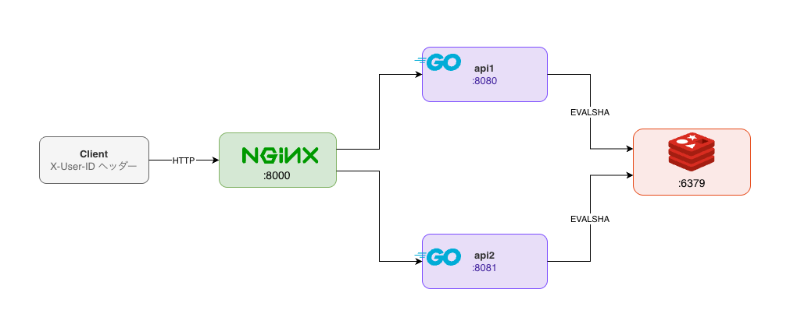

# go-ratelimit

Token Bucket アルゴリズムを使ったレートリミッターの実装。
複数サーバー間でトークン残量を共有するために Redis + Lua スクリプトを使っている。

## 構成



nginx がリクエストを api1/api2 に振り分け、両サーバーが同一の Redis を参照してトークン状態を共有する。

ストアは `Store` インターフェースで抽象化されており、`REDIS_ADDR` 環境変数の有無で MemoryStore と RedisStore を切り替えられる。

## なぜ Lua スクリプトが必要か

Redis のトークン補充は `GET → 計算 → SET` の 3 操作になる。
これを素直に実装すると、2 サーバーが同時に `GET` した瞬間に同じ残量を読み、両方が消費を確定させてしまう。

```
api1: GET tokens=1 → 許可と判断
api2: GET tokens=1 → 許可と判断  ← 同じ値を読んでいる
api1: SET tokens=0
api2: SET tokens=0              ← 2リクエスト許可されてしまう
```

`EVALSHA` で 3 操作を 1 トランザクションにまとめることで、Redis 側で直列実行が保証される。

## 設定

| 環境変数 | デフォルト | 説明 |
|---|---|---|
| `CAPACITY` | `10` | バケツの最大トークン数 |
| `REFILL_RATE` | `1` | 1秒あたりの補充トークン数 |
| `REDIS_ADDR` | (未設定) | Redis のアドレス。未設定の場合は MemoryStore を使う |

```bash
# docker compose で値を変えて起動
CAPACITY=100 REFILL_RATE=5 docker compose -f redis.docker-compose.yml up --build

# ローカル単体起動
CAPACITY=5 REFILL_RATE=0.5 go run .
```

## 動作確認

```bash
# Redis版 (複数インスタンスでトークン状態を共有)
docker compose -f redis.docker-compose.yml up --build

# Memory版 (インスタンスごとに独立したカウンター)
docker compose -f memory.docker-compose.yml up --build
```

起動後、15回連打して 200 → 429 の遷移を確認:

```bash
for i in $(seq 1 15); do
  response=$(curl -s -w "\n%{http_code}" -H "X-User-ID: alice" http://localhost:8000/ping)
  printf "[%s] %s\n" "$(echo "$response" | tail -1)" "$(echo "$response" | head -1)"
done
```

**Redis版** (CAPACITY=10): 10回で制限、api1/api2をまたいでカウントが共有される

```
[200] pong from api1
[200] pong from api2
...
[200] pong from api2   # 10回目
[429] 429 Too Many Requests
[429] 429 Too Many Requests
...
```

**Memory版** (CAPACITY=10): インスタンスごとに独立カウンターなので15回では制限に達しない

```
[200] pong from api1
[200] pong from api2
...
[200] pong from api1   # 15回目も200
```

レスポンスヘッダー:
- 許可時: `X-RateLimit-Remaining`, `X-RateLimit-Reset`
- 拒否時: `429 Too Many Requests`, `Retry-After`

## テスト

```bash
# 単体テスト + race detector
go test ./ratelimit/... -race -v

# ベンチマーク (CPU数を変えて並列スケーラビリティを比較)
go test ./ratelimit/... -bench=. -benchmem -benchtime=5s -cpu=1,4
```

ベンチマーク結果 (Apple M2 Pro, `-benchtime=5s -cpu=1,4`):

| ベンチマーク | CPU数 | ns/op (1回あたりの処理時間) | B/op (1回あたりのヒープ使用量) | allocs/op (1回あたりのメモリ確保回数) |
|---|---|---|---|---|
| MemoryStore_Allow | 1 | 71.09 | 0 | 0 |
| MemoryStore_Allow | 4 | 70.18 | 0 | 0 |
| MemoryStore_AllowParallel | 1 | 69.78 | 0 | 0 |
| MemoryStore_AllowParallel | 4 | 157.5 | 0 | 0 |
| RedisStore_Allow | 1 | 86,448 | 208,524 | 843 |
| RedisStore_Allow | 4 | 87,751 | 208,578 | 843 |
| RedisStore_AllowParallel | 1 | 85,499 | 208,524 | 843 |
| RedisStore_AllowParallel | 4 | 88,689 | 208,605 | 843 |
| Middleware_Allow | 1 | 736.9 | 1,088 | 15 |
| Middleware_Allow | 4 | 660.3 | 1,088 | 15 |
| Middleware_AllowParallel | 1 | 743.5 | 1,088 | 15 |
| Middleware_AllowParallel | 4 | 583.9 | 1,088 | 15 |

**MemoryStore**

in-memory なのでネットワーク IO がなく最速（約 71 ns/op）。ただし並列時は Mutex の待ち時間が発生するため、4 並列で約 2.3 倍悪化する。

**RedisStore**

Redis はシングルスレッドで処理するため、複数 goroutine から同時にリクエストが来ても Redis 側でキューイングされる。そのため並列化しても速度がほぼ変わらない。一方でネットワーク IO や Lua スクリプトの送受信コストがあるため、MemoryStore より約 1200 倍遅い（約 86,000 ns/op）。複数サーバー間でトークン状態を共有できるのはこのコストの対価。

**Middleware**

`Allow()` の呼び出しに加え、`fmt.Sprintf` によるキー生成・`strconv` による数値→文字列変換・レスポンスヘッダーへのセットなどのアロケーションが発生する。MemoryStore 単体の約 10 倍（約 737 ns/op）、15 allocs/op はこれらのコストを反映している。
